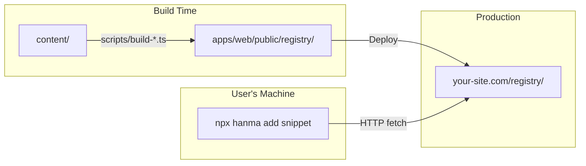

# Hanma Architecture

A monorepo for sharing backend code snippets, modules, and templates across frameworks.

## Project Overview

```
hanma/
├── content/              # Source of truth for all shareable code
│   ├── snippets/         # Atomic code pieces
│   ├── modules/          # Feature bundles
│   ├── shared/           # Cross-framework addons
│   ├── templates/        # Project starters
│   └── tooling/          # Dev tool configs
│
├── apps/
│   ├── cli/              # CLI tool (published to npm as 'hanma')
│   │   └── src/          # CLI source code
│   │
│   └── web/              # Website (deployed to cloud)
│       ├── public/
│       │   ├── registry/ # Built snippet registry (JSON)
│       │   └── templates/# Built template registry (JSON)
│       └── src/          # React app source
│
├── packages/             # Shared monorepo configs
│   ├── eslint-config/
│   ├── typescript-config/
│   └── ui/
│
└── scripts/              # Build scripts
    ├── build-registry.ts # Builds snippet registry
    ├── build-modules.ts  # Builds module registry
    └── build-templates.ts# Builds template registry
```

## How It Works



### 1. Content Lives at Root

All snippets, modules, and templates are authored in `content/`. This keeps the source of truth in one place and decoupled from the CLI.

### 2. Build Scripts Generate Registry

The `scripts/` folder contains build scripts that:
- Read `.hbs` files from `content/`
- Parse YAML frontmatter and code
- Output JSON files to `apps/web/public/`

```bash
npx tsx scripts/build-registry.ts  # → apps/web/public/registry/*.json (snippets)
npx tsx scripts/build-modules.ts   # → apps/web/public/modules/*.json (modules)
npx tsx scripts/build-templates.ts # → apps/web/public/templates/*.json (templates)
```

### 3. Web Serves the Registry

Deploy `apps/web` to any static host (Vercel, Netlify, GitHub Pages). The JSON registry files are served publicly.

### 4. CLI Fetches at Runtime

When users run `hanma add <snippet>`, the CLI fetches from the deployed web registry. The CLI npm package is lightweight—it doesn't bundle content.

## Content Structure

### Snippets
Individual code files with YAML frontmatter:

```
content/snippets/<framework>/<version>/<category>/<name>.hbs
```

### Modules
Feature bundles that reference multiple snippets:

```
content/modules/<framework>/<version>/<feature>/_meta.yaml
```

### Templates
Project starters that compose snippets/modules:

```
content/templates/<category>/<variant>/_meta.yaml
```

## Deployment

| Component | Published To | Contains |
|-----------|-------------|----------|
| `apps/web` | Vercel/Netlify | Website + registry JSON |
| `apps/cli` | npm (`hanma`) | CLI binary only (no content) |

### Build & Deploy Steps

```bash
# 1. Build registries (run before deploying web)
pnpm run build:registry
pnpm run build:templates

# 2. Deploy web
cd apps/web && pnpm build
# Deploy dist/ to your host

# 3. Publish CLI (separately)
cd apps/cli && pnpm build
npm publish
```

